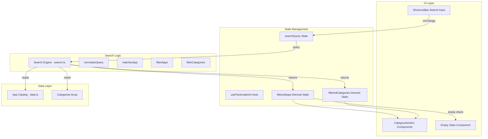

# Design Document: Smart Search

## Overview

This design document describes the implementation of smart search functionality for Packmate. The feature enables real-time filtering of the app catalog (180+ apps across 15 categories) using a search input triggered by the "/" keyboard shortcut. The search supports matching by app name, description keywords, and category names with partial matching and case-insensitive comparison.

The implementation follows a modular approach with a dedicated search utility module (`search.ts`) that provides pure functions for filtering, integrated into the existing `usePackmateInit` hook and page component.

## Architecture



## Components and Interfaces

### Search Utility Module (`packmate/src/lib/search.ts`)

```typescript
import { AppData, Category } from './data';

/**
 * Normalizes a search query for consistent matching
 * - Converts to lowercase
 * - Trims whitespace
 * - Collapses multiple spaces
 */
export function normalizeQuery(query: string): string;

/**
 * Checks if an app matches the search query
 * Matches against: name, description, category
 */
export function matchesApp(app: AppData, normalizedQuery: string): boolean;

/**
 * Filters apps based on search query
 * Returns all apps if query is empty
 */
export function filterApps(apps: AppData[], query: string): AppData[];

/**
 * Filters categories to only include those with matching apps
 * Returns all categories if query is empty
 */
export function filterCategories(
  categories: Category[],
  apps: AppData[],
  query: string
): Category[];

/**
 * Gets filtered apps for a specific category
 */
export function getFilteredAppsByCategory(
  apps: AppData[],
  category: Category,
  query: string
): AppData[];
```

### Updated usePackmateInit Hook Interface

The hook will be extended to include search state and filtered results:

```typescript
interface UsePackmateInitReturn {
  // ... existing properties ...
  
  // Search State
  searchQuery: string;
  setSearchQuery: (query: string) => void;
  
  // Filtered Results (derived state)
  filteredApps: AppData[];
  filteredCategories: Category[];
  getFilteredAppsByCategory: (category: Category) => AppData[];
  
  // Search Status
  hasSearchResults: boolean;
}
```

### Empty State Component

A simple component to display when no search results are found:

```typescript
interface SearchEmptyStateProps {
  query: string;
  onClear: () => void;
}
```

## Data Models

### Search Result Types

```typescript
/** Result of filtering apps by search query */
interface SearchResult {
  /** Apps that match the search query */
  apps: AppData[];
  /** Categories that contain matching apps */
  categories: Category[];
  /** Whether any results were found */
  hasResults: boolean;
}

/** Normalized search context for efficient matching */
interface SearchContext {
  /** Original query string */
  originalQuery: string;
  /** Normalized (lowercase, trimmed) query */
  normalizedQuery: string;
  /** Whether search is active (non-empty query) */
  isActive: boolean;
}
```

### Matching Strategy

The search uses a simple substring matching strategy:

1. **Name Match**: `app.name.toLowerCase().includes(normalizedQuery)`
2. **Description Match**: `app.description.toLowerCase().includes(normalizedQuery)`
3. **Category Match**: `app.category.toLowerCase().includes(normalizedQuery)`

An app matches if ANY of these conditions are true (OR logic).

## Correctness Properties

*A property is a characteristic or behavior that should hold true across all valid executions of a system—essentially, a formal statement about what the system should do. Properties serve as the bridge between human-readable specifications and machine-verifiable correctness guarantees.*


### Property 1: All Returned Apps Match Query

*For any* non-empty search query and any app in the filtered results, that app must match the query by having the normalized query as a substring of its name, description, or category (case-insensitive).

**Validates: Requirements 1.1, 2.1, 3.1, 4.1**

### Property 2: Empty Query Returns All Apps

*For any* empty string or whitespace-only query, the filterApps function shall return all apps from the catalog without filtering.

**Validates: Requirements 1.2, 5.3**

### Property 3: Name Substring Inclusion

*For any* app in the catalog and any non-empty substring of that app's name, searching for that substring shall include that app in the results.

**Validates: Requirements 2.1, 2.2, 2.3**

### Property 4: Description Substring Inclusion

*For any* app in the catalog and any non-empty substring of that app's description, searching for that substring shall include that app in the results.

**Validates: Requirements 3.1, 3.2, 3.3**

### Property 5: Category Substring Inclusion

*For any* app in the catalog and any non-empty substring of that app's category name, searching for that substring shall include that app in the results.

**Validates: Requirements 4.1, 4.2**

### Property 6: Filtered Categories Contain Only Matching Apps

*For any* search query and any category in the filtered categories result, that category must contain at least one app that matches the query. Conversely, if a category contains no matching apps, it shall not appear in the filtered categories.

**Validates: Requirements 5.1, 5.2, 6.3**

### Property 7: Query Normalization Consistency

*For any* search query, searching with different case variations (uppercase, lowercase, mixed) or with added leading/trailing whitespace shall return the same set of apps.

**Validates: Requirements 8.1, 8.2, 8.3**

## Error Handling

### Invalid Input Handling

| Scenario | Handling |
|----------|----------|
| `null` or `undefined` query | Treat as empty string, return all apps |
| Query with only whitespace | Treat as empty string, return all apps |
| Query with special regex characters | Treat as literal characters (no regex interpretation) |
| Empty app catalog | Return empty results array |

### Edge Cases

1. **Very long queries**: No special handling needed; substring matching naturally handles this
2. **Unicode characters**: Standard JavaScript string operations handle Unicode correctly
3. **Apps with empty descriptions**: Match only on name and category

## Testing Strategy

### Unit Tests

Unit tests will cover specific examples and edge cases:

1. **Empty query handling**: Verify all apps returned for empty/whitespace queries
2. **Case insensitivity**: Verify "FIREFOX", "firefox", "Firefox" all match
3. **Partial matching**: Verify "fire" matches "Firefox"
4. **Category filtering**: Verify only categories with matches are returned
5. **No results**: Verify empty array for queries matching nothing

### Property-Based Tests

Property-based tests will use **fast-check** library to verify universal properties:

- **Minimum 100 iterations** per property test
- Each test tagged with: **Feature: smart-search, Property {number}: {property_text}**
- Tests located in `packmate/src/__tests__/lib/search.test.ts`

**Test Configuration:**
```typescript
import * as fc from 'fast-check';

// Configure fast-check for 100+ iterations
fc.configureGlobal({ numRuns: 100 });
```

### Test File Structure

```
packmate/src/__tests__/lib/
└── search.test.ts
    ├── describe('normalizeQuery')
    │   ├── unit tests for edge cases
    │   └── property tests for normalization consistency
    ├── describe('matchesApp')
    │   └── unit tests for matching logic
    ├── describe('filterApps')
    │   ├── unit tests for specific scenarios
    │   └── property tests for filtering invariants
    └── describe('filterCategories')
        ├── unit tests for category filtering
        └── property tests for category invariants
```

### Animation Testing

Animation behavior (Requirement 9) will be tested through:
- Visual inspection during development
- Integration tests verifying CSS classes are applied correctly
- No property-based tests for animations (UI behavior, not computable properties)
