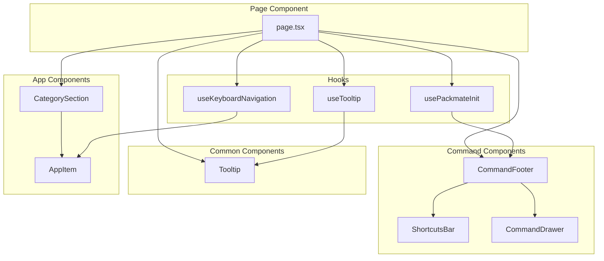

# Design Document: Command Footer UX Improvements

## Overview

This design enhances Packmate's command footer section with vim-style keyboard navigation, an enhanced shortcuts bar, a rich tooltip system, and a command preview drawer. The implementation follows TuxMate's proven patterns while adapting them for Packmate's cross-platform package manager context.

The key components are:
1. **useKeyboardNavigation hook** - Manages vim-style grid navigation with focus tracking
2. **ShortcutsBar component** - Neovim-style statusline with search and shortcuts
3. **Enhanced CommandFooter** - Wider footer with keyboard shortcuts and preview toggle
4. **CommandDrawer component** - Expandable preview panel for full script display
5. **Enhanced Tooltip system** - Follow-cursor tooltips with markdown formatting

## Architecture



## Components and Interfaces

### 1. useKeyboardNavigation Hook

```typescript
// packmate/src/hooks/useKeyboardNavigation.ts

export interface NavItem {
  type: 'category' | 'app';
  id: string;
  category: Category;
}

export interface FocusPosition {
  col: number;
  row: number;
}

interface UseKeyboardNavigationReturn {
  focusPos: FocusPosition | null;
  focusedItem: NavItem | null;
  clearFocus: () => void;
  setFocusByItem: (type: 'category' | 'app', id: string) => void;
  isKeyboardNavigating: boolean;
}

export function useKeyboardNavigation(
  navItems: NavItem[][],
  onToggleCategory: (id: string) => void,
  onToggleApp: (id: string) => void
): UseKeyboardNavigationReturn;
```

**Behavior:**
- Tracks focus position as (col, row) in the navigation grid
- Handles arrow keys (↑↓←→) and vim keys (hjkl) for navigation
- Space toggles the focused item's selection state
- Escape clears focus
- Distinguishes keyboard navigation (triggers scroll) from mouse selection (no scroll)
- Provides `isKeyboardNavigating` flag for focus ring visibility

### 2. ShortcutsBar Component

```typescript
// packmate/src/components/command/ShortcutsBar.tsx

interface ShortcutsBarProps {
  searchQuery: string;
  onSearchChange: (query: string) => void;
  searchInputRef: React.RefObject<HTMLInputElement | null>;
  selectedCount: number;
  packageManagerName: string;
  packageManagerColor: string;
}

export function ShortcutsBar(props: ShortcutsBarProps): JSX.Element;
```

**Layout:**
```
┌─────────────────────────────────────────────────────────────────────────┐
│ [PM_NAME] │ / search...  [x] │ [N apps] │ shortcuts... │ PACK │
└─────────────────────────────────────────────────────────────────────────┘
```

**Features:**
- Package manager badge with color (left)
- Search input with "/" prefix and clear button
- Selected app count display
- Keyboard shortcuts reference (hidden on mobile)
- Branded "PACK" end badge

### 3. Enhanced CommandFooter Component

```typescript
// packmate/src/components/command/CommandFooter.tsx

interface CommandFooterProps {
  command: string;
  selectedCount: number;
  selectedApps: Set<string>;
  packageManagerId: PackageManagerId;
  searchQuery: string;
  onSearchChange: (query: string) => void;
  searchInputRef: React.RefObject<HTMLInputElement | null>;
  clearAll: () => void;
}

export function CommandFooter(props: CommandFooterProps): JSX.Element;
```

**Layout:**
```
┌─────────────────────────────────────────────────────────────────────────┐
│ ShortcutsBar                                                            │
├─────────────────────────────────────────────────────────────────────────┤
│ [Preview] │        command text        │ [Clear] │ [Download] │ [Copy] │
└─────────────────────────────────────────────────────────────────────────┘
```

**Features:**
- 85% width with soft glow background
- Colored left border accent (package manager color)
- Preview button opens CommandDrawer
- Clear, Download, Copy buttons with hover effects
- Global keyboard shortcuts: y=copy, d=download, t=theme, c=clear, Tab=preview

### 4. CommandDrawer Component

```typescript
// packmate/src/components/command/CommandDrawer.tsx

interface CommandDrawerProps {
  isOpen: boolean;
  isClosing: boolean;
  onClose: () => void;
  command: string;
  selectedCount: number;
  copied: boolean;
  onCopy: () => void;
  onDownload: () => void;
  packageManagerColor: string;
  packageManagerId: PackageManagerId;
}

export function CommandDrawer(props: CommandDrawerProps): JSX.Element;
```

**Features:**
- Slides up from bottom with animation
- Displays full generated script in scrollable code block
- Copy and download buttons within drawer
- Close button and Escape key to dismiss
- Package manager info and app count display

### 5. Enhanced Tooltip System

```typescript
// packmate/src/hooks/useTooltip.ts

export interface TooltipState {
  content: string;
  x: number;
  y: number;
}

interface UseTooltipReturn {
  tooltip: TooltipState | null;
  show: (content: string, e: React.MouseEvent) => void;
  hide: () => void;
  tooltipMouseEnter: () => void;
  tooltipMouseLeave: () => void;
  setTooltipRef: (el: HTMLDivElement | null) => void;
}

export function useTooltip(): UseTooltipReturn;
```

```typescript
// packmate/src/components/common/Tooltip.tsx

interface TooltipProps {
  tooltip: TooltipState | null;
  onMouseEnter: () => void;
  onMouseLeave: () => void;
  setRef?: (el: HTMLDivElement | null) => void;
}

export function Tooltip(props: TooltipProps): JSX.Element | null;
```

**Features:**
- Follow-cursor positioning (uses mouse X, element top Y)
- 450ms delay before showing
- Stays open while hovering trigger or tooltip
- Markdown-ish formatting: **bold**, `code`, [links](url)
- Right-anchor adjustment when near viewport edge
- Arrow indicator pointing to cursor
- 300px fixed width with word wrapping
- Dismisses on click, scroll, or Escape

## Data Models

### Navigation Grid Structure

The navigation grid is a 2D array where each column represents a visual column of categories/apps:

```typescript
type NavGrid = NavItem[][];

// Example structure for 5-column layout:
// navItems[0] = [category1, app1, app2, category2, app3, ...]
// navItems[1] = [category3, app4, app5, ...]
// ...
```

### Focus State

```typescript
interface FocusState {
  position: FocusPosition | null;  // Current (col, row) or null if no focus
  fromKeyboard: boolean;           // Whether focus was set via keyboard
  isNavigating: boolean;           // Whether keyboard navigation is active
}
```

### Tooltip State

```typescript
interface TooltipState {
  content: string;  // Text content with markdown-ish formatting
  x: number;        // Mouse X position
  y: number;        // Element top Y position
}

interface TooltipRefs {
  showTimeout: NodeJS.Timeout | null;
  hideTimeout: NodeJS.Timeout | null;
  isOverTrigger: boolean;
  isOverTooltip: boolean;
  tooltipElement: HTMLDivElement | null;
}
```

### Drawer State

```typescript
interface DrawerState {
  isOpen: boolean;
  isClosing: boolean;  // For exit animation
}
```


## Correctness Properties

*A property is a characteristic or behavior that should hold true across all valid executions of a system—essentially, a formal statement about what the system should do. Properties serve as the bridge between human-readable specifications and machine-verifiable correctness guarantees.*

### Property 1: Navigation Movement Bounds

*For any* navigation grid and any focus position, pressing a navigation key (↑↓←→ or hjkl) SHALL result in a new focus position that is within the grid bounds (0 ≤ col < numColumns, 0 ≤ row < columnLength).

**Validates: Requirements 1.1**

### Property 2: Space Toggles Selection State

*For any* focused app item, pressing Space SHALL change its selection state from selected to unselected, or from unselected to selected.

**Validates: Requirements 1.2**

### Property 3: Escape Clears Focus

*For any* focus state (including null), pressing Escape SHALL result in a null focus position.

**Validates: Requirements 1.3**

### Property 4: Keyboard Navigation Flag

*For any* navigation event triggered by keyboard (arrow keys or hjkl), the `isKeyboardNavigating` flag SHALL be true. *For any* focus change triggered by mouse click, the `isKeyboardNavigating` flag SHALL be false.

**Validates: Requirements 1.5, 1.6**

### Property 5: Package Manager Badge Rendering

*For any* package manager with a name and color, the ShortcutsBar SHALL render a badge containing that package manager's name.

**Validates: Requirements 2.1**

### Property 6: App Count Display

*For any* selectedCount > 0, the ShortcutsBar SHALL display the count. *For any* selectedCount === 0, the count display SHALL be hidden.

**Validates: Requirements 2.3**

### Property 7: Search Input Callback

*For any* text typed into the search input, the onSearchChange callback SHALL be called with that text value.

**Validates: Requirements 2.6**

### Property 8: Keyboard Shortcuts Trigger Actions

*For any* valid shortcut key ('y', 'd', 't', 'c', 'Tab') pressed when not in an input field and without modifier keys, the corresponding action SHALL be triggered (copy, download, theme toggle, clear, drawer toggle respectively).

**Validates: Requirements 3.4, 3.5, 3.6, 3.7, 3.8**

### Property 9: Drawer Shows Script When Open

*For any* CommandDrawer with isOpen=true and a non-empty command string, the drawer SHALL render the command string in a code block.

**Validates: Requirements 4.1**

### Property 10: Drawer Shows Count and Package Manager

*For any* CommandDrawer with isOpen=true, the drawer SHALL display the selectedCount and package manager information.

**Validates: Requirements 4.4**

### Property 11: Tooltip Follows Cursor X Position

*For any* tooltip show event with mouse position (x, y), the tooltip's x coordinate SHALL equal the mouse's clientX value.

**Validates: Requirements 5.1**

### Property 12: Tooltip Markdown Parsing

*For any* string containing **bold**, `code`, or [link](url) patterns, the tooltip's renderContent function SHALL transform them into the corresponding React elements (strong, code, anchor).

**Validates: Requirements 5.2**

### Property 13: Tooltip Edge Adjustment

*For any* tooltip position where x + 300 > viewport width, the tooltip SHALL apply a right-anchor transform to keep it within the viewport.

**Validates: Requirements 5.3**

### Property 14: Tooltip Hover Persistence

*For any* tooltip that is visible, if the mouse enters the tooltip element (isOverTooltip=true), the tooltip SHALL remain visible even if the mouse leaves the trigger element.

**Validates: Requirements 5.7**

### Property 15: Tooltip Dismiss Events

*For any* visible tooltip, a mousedown, scroll, or Escape keydown event SHALL immediately set the tooltip state to null.

**Validates: Requirements 5.8**

### Property 16: Input and Modifier Shortcut Bypass

*For any* keyboard event where the target is an input/textarea/select element OR any modifier key (Ctrl, Alt, Meta) is pressed, custom keyboard shortcuts SHALL NOT be processed.

**Validates: Requirements 6.3, 6.4**

### Property 17: Disabled Shortcuts When No Selection

*For any* state where selectedCount === 0, the 'y' (copy) and 'd' (download) shortcuts SHALL NOT trigger their actions, but 't' (theme) and 'c' (clear) shortcuts SHALL still work.

**Validates: Requirements 6.5**

## Error Handling

### Keyboard Navigation Errors

1. **Invalid Grid Position**: If navigation would move outside grid bounds, clamp to valid range
2. **Empty Grid**: If navItems is empty, keyboard navigation is disabled (no-op)
3. **Missing Element**: If focused element's DOM node is not found, skip scrollIntoView

### Clipboard Errors

1. **Clipboard API Unavailable**: If `navigator.clipboard.writeText` fails (e.g., insecure context), log error and optionally show user feedback
2. **Empty Command**: If selectedCount is 0, copy/download actions are no-ops

### Tooltip Errors

1. **Missing Tooltip Element**: If tooltipRef is null when trying to check contains(), treat as not over tooltip
2. **Window Undefined**: Guard against SSR by checking `typeof window !== 'undefined'`

### Drawer Errors

1. **Animation Timing**: Use isClosing state to prevent re-opening during close animation
2. **Escape During Animation**: Allow Escape to trigger close even during animation

## Testing Strategy

### Unit Tests

Unit tests will cover specific examples and edge cases:

1. **Navigation edge cases**: Focus at grid boundaries, empty grid, single-item grid
2. **Tooltip positioning**: Near left edge, near right edge, exact boundary
3. **Markdown parsing**: Empty string, no markdown, nested patterns, malformed patterns
4. **Keyboard shortcuts**: With/without modifiers, in input fields, with zero selection

### Property-Based Tests

Property-based tests will use **fast-check** library for TypeScript/JavaScript.

Each property test will:
- Run minimum 100 iterations
- Be tagged with the property number and requirements reference
- Generate random valid inputs to verify universal properties

**Test Configuration:**
```typescript
import fc from 'fast-check';

// Minimum 100 iterations per property
const testConfig = { numRuns: 100 };
```

**Property Test Tags:**
```typescript
// Feature: command-footer-ux, Property 1: Navigation Movement Bounds
// Validates: Requirements 1.1
```

### Test File Structure

```
packmate/src/__tests__/
├── hooks/
│   ├── useKeyboardNavigation.test.ts  # Properties 1-4
│   └── useTooltip.test.ts             # Properties 11-15
├── components/
│   ├── ShortcutsBar.test.ts           # Properties 5-7
│   ├── CommandFooter.test.ts          # Properties 8, 16-17
│   └── CommandDrawer.test.ts          # Properties 9-10
└── common/
    └── Tooltip.test.ts                # Property 12 (markdown parsing)
```

### Integration Tests

Integration tests will verify component interactions:

1. **Full keyboard flow**: Navigate → Select → Copy → Verify clipboard
2. **Drawer flow**: Open drawer → Verify content → Close with Escape
3. **Tooltip flow**: Hover → Wait for delay → Verify content → Move to tooltip → Verify persistence
