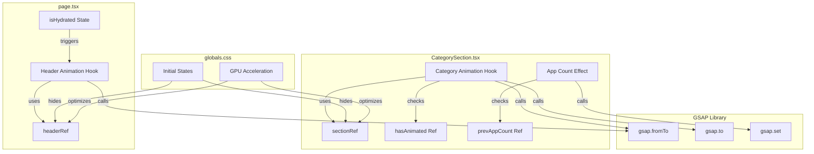

# Design Document: GSAP Animations for Packmate

## Overview

This design document outlines the implementation of GSAP animations for Packmate, replicating the animation patterns from TuxMate. The implementation adds polished entrance animations for the header and category sections, creating a professional and engaging user experience.

The animation system consists of two main components:
1. Header animations in `page.tsx` using `useLayoutEffect`
2. Category section animations in `CategorySection.tsx` using `useLayoutEffect` and `useEffect`

## Architecture



## Components and Interfaces

### 1. Header Animation (page.tsx)

The header animation runs once after hydration, animating the logo/title with a clip-path reveal and the controls with a fade-in effect.

```typescript
// Header animation hook in page.tsx
const headerRef = useRef<HTMLElement>(null);

useLayoutEffect(() => {
  if (!headerRef.current || !isHydrated) return;

  const header = headerRef.current;
  const title = header.querySelector('.header-animate');
  const controls = header.querySelector('.header-controls');

  // Clip-path reveal for logo/title
  gsap.fromTo(title,
    { clipPath: 'inset(0 100% 0 0)' },
    {
      clipPath: 'inset(0 0% 0 0)',
      duration: 0.8,
      ease: 'power2.out',
      delay: 0.1,
      onComplete: () => {
        if (title) gsap.set(title, { clipPath: 'none' });
      }
    }
  );

  // Fade-in for controls
  gsap.fromTo(controls,
    { opacity: 0, y: -10 },
    {
      opacity: 1,
      y: 0,
      duration: 0.6,
      ease: 'power2.out',
      delay: 0.3
    }
  );
}, [isHydrated]);
```

### 2. Category Section Animation (CategorySection.tsx)

Each category section animates its header and app items with staggered delays based on category index.

```typescript
interface CategorySectionProps {
  // ... existing props
  categoryIndex: number;  // Used for staggered animation delays
}

// Animation refs
const sectionRef = useRef<HTMLDivElement>(null);
const hasAnimated = useRef(false);
const prevAppCount = useRef(categoryApps.length);

// Initial entrance animation
useLayoutEffect(() => {
  if (!sectionRef.current || hasAnimated.current) return;
  hasAnimated.current = true;

  const section = sectionRef.current;
  const header = section.querySelector('.category-header');
  const items = section.querySelectorAll('.app-item');

  requestAnimationFrame(() => {
    // Set initial state with GPU acceleration
    gsap.set(header, { clipPath: 'inset(0 100% 0 0)' });
    gsap.set(items, { y: -15, opacity: 0, force3D: true });

    // Staggered delay based on category index
    const delay = categoryIndex * 0.05;

    // Animate header
    gsap.to(header, {
      clipPath: 'inset(0 0% 0 0)',
      duration: 0.6,
      ease: 'power2.out',
      delay: delay + 0.05
    });

    // Animate items
    gsap.to(items, {
      y: 0,
      opacity: 1,
      duration: 0.5,
      ease: 'power2.out',
      delay: delay + 0.1,
      force3D: true
    });
  });
}, [categoryIndex]);

// Handle app count changes (filter changes)
useEffect(() => {
  if (categoryApps.length !== prevAppCount.current && sectionRef.current) {
    const items = sectionRef.current.querySelectorAll('.app-item');
    gsap.set(items, { y: 0, opacity: 1, clearProps: 'all' });
  }
  prevAppCount.current = categoryApps.length;
}, [categoryApps.length]);
```

### 3. CSS Initial States (globals.css)

CSS classes that hide elements before GSAP animates them visible:

```css
/* Entrance animation initial states */
.category-header {
  clip-path: inset(0 100% 0 0);
}

.app-item {
  opacity: 0;
  transform: translateY(-20px);
  will-change: transform, opacity;
}

.header-animate {
  clip-path: inset(0 100% 0 0);
}

.header-controls {
  opacity: 0;
  transform: translateY(-10px);
}

/* GPU acceleration for animated elements */
.category-header,
.app-item,
.header-animate,
.header-controls {
  -webkit-backface-visibility: hidden;
  backface-visibility: hidden;
  -webkit-perspective: 1000px;
  perspective: 1000px;
}
```

## Data Models

### Animation Configuration

```typescript
// Animation timing constants
const ANIMATION_CONFIG = {
  header: {
    titleDuration: 0.8,
    titleDelay: 0.1,
    controlsDuration: 0.6,
    controlsDelay: 0.3,
    ease: 'power2.out'
  },
  category: {
    headerDuration: 0.6,
    itemsDuration: 0.5,
    staggerFactor: 0.05,  // delay = categoryIndex * staggerFactor
    headerDelayOffset: 0.05,
    itemsDelayOffset: 0.1,
    ease: 'power2.out'
  }
};
```

### Animation State Tracking

```typescript
// Refs for animation state management
interface AnimationState {
  hasAnimated: React.MutableRefObject<boolean>;  // Prevents re-animation
  prevAppCount: React.MutableRefObject<number>;  // Tracks filter changes
}
```

## Correctness Properties

*A property is a characteristic or behavior that should hold true across all valid executions of a system—essentially, a formal statement about what the system should do. Properties serve as the bridge between human-readable specifications and machine-verifiable correctness guarantees.*

### Property 1: Hydration Gate

*For any* animation trigger, the header animation SHALL only execute when isHydrated is true. If isHydrated is false, no GSAP animation calls should be made.

**Validates: Requirements 2.4**

### Property 2: Staggered Delay Calculation

*For any* category with index N, the animation delay SHALL equal N * 0.05 seconds. This ensures categories animate in sequence from top-left to bottom-right.

**Validates: Requirements 3.3**

### Property 3: Animation Idempotence

*For any* category section that has already animated (hasAnimated.current === true), subsequent renders SHALL NOT trigger new entrance animations. The animation should only run once per component mount.

**Validates: Requirements 3.5**

### Property 4: Filter Change Visibility Reset

*For any* category where the app count changes (due to package manager filter), all app items SHALL be immediately set to visible (opacity: 1, y: 0) without animation.

**Validates: Requirements 5.1**

### Property 5: Animation Duration Bound

*For any* page load, the total entrance animation duration (including all staggered delays) SHALL complete within 1 second. With 15 categories and stagger factor of 0.05, max delay is 0.75s + 0.6s duration = 1.35s, so we need to verify the actual implementation stays within bounds.

**Validates: Requirements 6.4**

## Error Handling

### Missing DOM Elements

```typescript
useLayoutEffect(() => {
  if (!headerRef.current || !isHydrated) return;
  
  const title = header.querySelector('.header-animate');
  const controls = header.querySelector('.header-controls');
  
  // Gracefully handle missing elements
  if (title) {
    gsap.fromTo(title, /* ... */);
  }
  if (controls) {
    gsap.fromTo(controls, /* ... */);
  }
}, [isHydrated]);
```

### GSAP Import Failure

If GSAP fails to load, the CSS initial states will keep elements hidden. The application should handle this gracefully by:
1. Using a try-catch around GSAP calls
2. Falling back to CSS-only animations if GSAP is unavailable

```typescript
useLayoutEffect(() => {
  if (!sectionRef.current || hasAnimated.current) return;
  
  try {
    // GSAP animations
  } catch (error) {
    // Fallback: immediately show all elements
    const items = sectionRef.current?.querySelectorAll('.app-item');
    items?.forEach(item => {
      (item as HTMLElement).style.opacity = '1';
      (item as HTMLElement).style.transform = 'none';
    });
  }
}, [categoryIndex]);
```

## Testing Strategy

### Unit Tests

Unit tests verify specific examples and edge cases:

1. **GSAP Dependency Test**: Verify gsap is in package.json dependencies
2. **CSS Initial States Test**: Verify globals.css contains required initial state rules
3. **Animation Config Test**: Verify animation timing constants are within expected ranges

### Property-Based Tests

Property tests verify universal properties across all inputs using fast-check:

1. **Hydration Gate Property**: Generate random isHydrated states and verify animation only runs when true
2. **Stagger Delay Property**: Generate random category indices and verify delay calculation
3. **Animation Idempotence Property**: Simulate multiple renders and verify animation only runs once
4. **Filter Change Property**: Generate random app count changes and verify visibility reset

### Integration Tests

1. **Full Page Animation**: Verify all animations complete without errors
2. **Package Manager Filter**: Verify animations handle filter changes correctly

### Test Configuration

- Use Vitest as the test runner
- Use fast-check for property-based testing (already in devDependencies)
- Minimum 100 iterations per property test
- Tag format: **Feature: gsap-animations, Property {number}: {property_text}**
