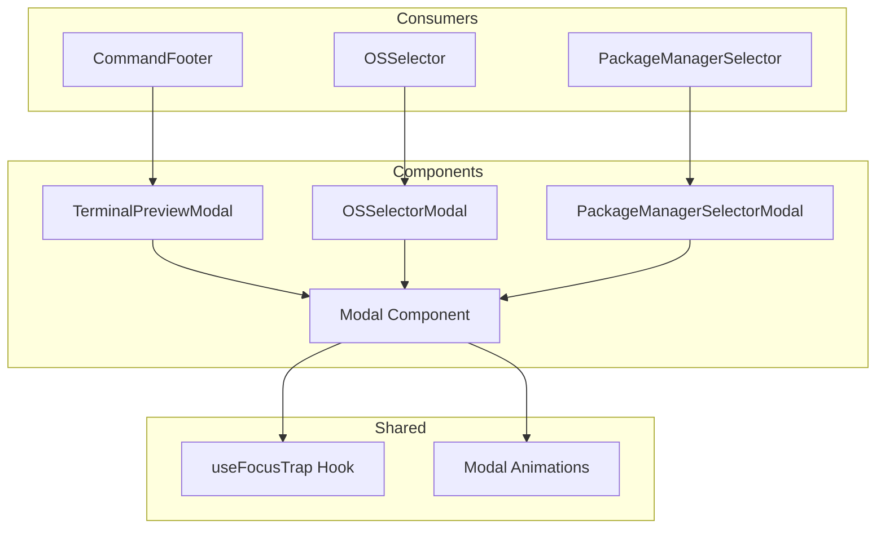

# Design Document: Modal Popup Selectors

## Overview

This design transforms the packmate application's selection interfaces from inline dropdowns and scrollable areas to a unified modal popup pattern. The implementation creates a reusable Modal component that serves as the foundation for three specific use cases: terminal preview, OS selection, and package manager selection.

The design prioritizes:
- **Consistency**: All modals share the same visual language and interaction patterns
- **Accessibility**: Full keyboard navigation and ARIA compliance
- **Performance**: Framer Motion for smooth, hardware-accelerated animations
- **Reusability**: A single Modal component that can be composed for different content types

## Architecture



## Components and Interfaces

### Modal Component

The base Modal component handles all common modal behavior:

```typescript
interface ModalProps {
  isOpen: boolean;
  onClose: () => void;
  children: React.ReactNode;
  title?: string;
  titleId?: string;
  maxWidth?: string;  // e.g., 'max-w-md', 'max-w-lg', 'max-w-2xl'
  className?: string;
}
```

**Implementation Details:**
- Uses React Portal to render at document body level
- Implements backdrop click detection
- Handles Escape key press
- Manages body scroll lock
- Provides focus trap via custom hook
- Uses Framer Motion for enter/exit animations

### TerminalPreviewModal Component

Displays the full installation script in a modal:

```typescript
interface TerminalPreviewModalProps {
  isOpen: boolean;
  onClose: () => void;
  selectedApps: Set<string>;
  packageManagerId: PackageManagerId;
  selectedCount: number;
}
```

**Features:**
- Syntax-highlighted script display (reuses existing highlightScript function)
- Copy button with success feedback
- Download button for script file
- Package manager branding (color accent, name display)
- Keyboard shortcuts (y=copy, d=download)

### OSSelectorModal Component

Modal for selecting operating system:

```typescript
interface OSSelectorModalProps {
  isOpen: boolean;
  onClose: () => void;
  selectedOS: OSId;
  onSelect: (id: OSId) => void;
}
```

**Features:**
- Grid layout of OS options (2-3 columns depending on viewport)
- Each option shows icon, name, and colored border accent
- Current selection highlighted with background color
- Keyboard navigation with arrow keys
- Auto-focus on currently selected item when opened

### PackageManagerSelectorModal Component

Modal for selecting package manager:

```typescript
interface PackageManagerSelectorModalProps {
  isOpen: boolean;
  onClose: () => void;
  selectedOS: OSId;
  selectedPackageManager: PackageManagerId;
  onSelect: (id: PackageManagerId) => void;
}
```

**Features:**
- List layout of package managers filtered by OS
- "Default" badge for primary package managers
- Checkmark indicator for current selection
- Colored border accent per package manager
- Full keyboard navigation (arrows, Home, End, Enter)

### useFocusTrap Hook

Custom hook for managing focus within modals:

```typescript
function useFocusTrap(
  containerRef: React.RefObject<HTMLElement>,
  isActive: boolean
): void;
```

**Behavior:**
- Captures focus when modal opens
- Cycles focus through focusable elements on Tab
- Returns focus to trigger element on close

## Data Models

### Modal State

Each component manages its own modal open/close state:

```typescript
// In OSSelector
const [isModalOpen, setIsModalOpen] = useState(false);

// In PackageManagerSelector  
const [isModalOpen, setIsModalOpen] = useState(false);

// In CommandFooter (replaces isDrawerOpen)
const [isPreviewModalOpen, setIsPreviewModalOpen] = useState(false);
```

### Animation Variants

Framer Motion variants for consistent animations:

```typescript
const backdropVariants = {
  hidden: { opacity: 0 },
  visible: { opacity: 1 },
};

const modalVariants = {
  hidden: { 
    opacity: 0, 
    scale: 0.95,
    y: 20 
  },
  visible: { 
    opacity: 1, 
    scale: 1,
    y: 0,
    transition: {
      type: 'spring',
      damping: 25,
      stiffness: 300
    }
  },
  exit: {
    opacity: 0,
    scale: 0.95,
    y: 20,
    transition: {
      duration: 0.2,
      ease: 'easeIn'
    }
  }
};
```


## Correctness Properties

*A property is a characteristic or behavior that should hold true across all valid executions of a system—essentially, a formal statement about what the system should do. Properties serve as the bridge between human-readable specifications and machine-verifiable correctness guarantees.*

### Property 1: Modal Dismiss Behavior

*For any* Modal instance that is open, clicking the backdrop OR pressing the Escape key SHALL trigger the onClose callback and close the modal.

**Validates: Requirements 1.2, 1.3**

### Property 2: Focus Trap Cycling

*For any* Modal with N focusable elements (where N > 0), pressing Tab N times from the first focusable element SHALL return focus to the first focusable element, and pressing Shift+Tab from the first element SHALL move focus to the last element.

**Validates: Requirements 1.6**

### Property 3: Modal Width Constraint Application

*For any* maxWidth prop value passed to Modal, the modal content panel SHALL have that width constraint class applied to its className.

**Validates: Requirements 1.8**

### Property 4: Terminal Preview Content Correctness

*For any* set of selected apps and package manager ID, the Terminal Preview modal SHALL display the complete generated script (matching generateInstallScript output) and the header SHALL show the correct package manager name and app count.

**Validates: Requirements 2.3, 2.6**

### Property 5: Terminal Preview Keyboard Shortcuts

*For any* open Terminal Preview modal, pressing 'y' SHALL trigger the copy action, pressing 'd' SHALL trigger the download action, and pressing 'Escape' SHALL close the modal.

**Validates: Requirements 2.7**

### Property 6: OS Selector Renders All Options

*For any* OS in the operatingSystems array, the OS Selector modal SHALL render an option containing the OS icon, OS name, and a left border with the OS's brand color.

**Validates: Requirements 3.2, 3.4, 3.7**

### Property 7: OS Selector Highlights Current Selection

*For any* selectedOS value, the corresponding option in the OS Selector modal SHALL have a visually distinct background style compared to non-selected options.

**Validates: Requirements 3.3**

### Property 8: OS Selector Keyboard Navigation

*For any* open OS Selector modal with focused option at index I, pressing ArrowDown SHALL move focus to index (I+1) mod N, pressing ArrowUp SHALL move focus to index (I-1+N) mod N, and pressing Enter SHALL select the focused option.

**Validates: Requirements 3.6**

### Property 9: Package Manager Filtering by OS

*For any* selected OS, the Package Manager Selector modal SHALL display exactly the package managers returned by getPackageManagersByOS(selectedOS), and no others.

**Validates: Requirements 4.2**

### Property 10: Package Manager Options Render Correctly

*For any* package manager in the filtered list, the option SHALL display the package manager icon, name, brand-colored left border, and a "Default" badge if isPrimary is true.

**Validates: Requirements 4.4, 4.7, 4.8**

### Property 11: Package Manager Highlights Current Selection

*For any* selectedPackageManager value, the corresponding option in the Package Manager Selector modal SHALL have a visually distinct style and checkmark indicator.

**Validates: Requirements 4.3**

### Property 12: Package Manager Keyboard Navigation

*For any* open Package Manager Selector modal with N options and focused index I, ArrowDown moves to (I+1) mod N, ArrowUp moves to (I-1+N) mod N, Home moves to 0, End moves to N-1, Enter selects, and Escape closes.

**Validates: Requirements 4.6**

## Error Handling

### Modal Errors

| Error Condition | Handling Strategy |
|----------------|-------------------|
| Portal container not found | Gracefully return null, log warning in development |
| Focus trap fails to find focusable elements | Allow normal tab behavior, don't trap |
| Clipboard API unavailable | Show error toast, log to console |
| Animation library fails to load | Fall back to CSS transitions |

### Selector Errors

| Error Condition | Handling Strategy |
|----------------|-------------------|
| No package managers for selected OS | Show empty state message in modal |
| Invalid OS/PM ID passed | Default to first available option |
| onSelect callback throws | Catch error, log, keep modal open |

## Testing Strategy

### Unit Tests

Unit tests verify specific examples and edge cases:

- Modal renders with correct ARIA attributes
- Modal prevents body scroll when open
- Backdrop has correct blur and opacity classes
- Copy button shows success state after clipboard write
- Download generates correct file extension (.sh vs .ps1)
- Empty selection shows appropriate message

### Property-Based Tests

Property tests verify universal properties across all inputs using **fast-check** library:

**Configuration:**
- Minimum 100 iterations per property test
- Each test tagged with: **Feature: modal-popup-selectors, Property {N}: {property_text}**

**Test Implementation:**

1. **Modal Dismiss Property Test**: Generate random modal states, verify onClose called on backdrop click and Escape
2. **Focus Trap Property Test**: Generate modals with 1-10 focusable elements, verify Tab cycling
3. **OS Selector Rendering Test**: For all OS in data, verify icon, name, and color rendered
4. **Package Manager Filtering Test**: For all OS values, verify filtered list matches getPackageManagersByOS
5. **Keyboard Navigation Tests**: Generate random starting indices, verify arrow key navigation wraps correctly

### Integration Tests

- Full flow: Open OS modal → Select OS → Open PM modal → Select PM → Open preview → Copy
- Keyboard-only navigation through all modals
- Theme persistence across modal open/close cycles
