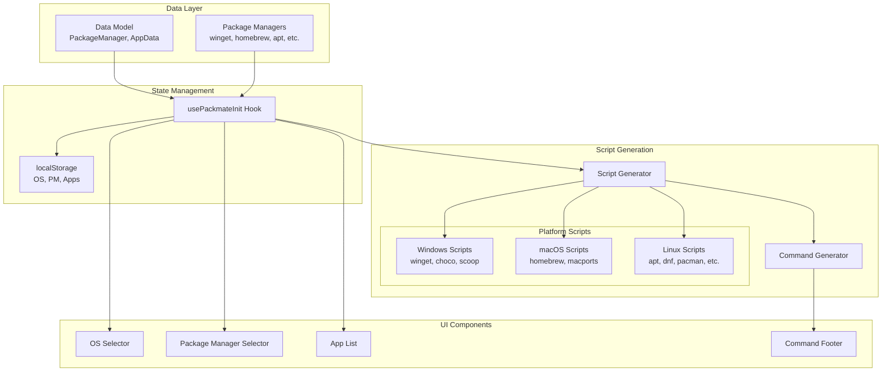

# Design Document: Package Manager Integration

## Overview

This design extends Packmate to support multi-platform package manager integration, enabling users to generate installation commands and scripts for their preferred package manager. The architecture follows the established patterns from TuxMate while adapting them for cross-platform support (Windows, macOS, Linux).

The system introduces:
1. A new data model with `targets` mapping package managers to package names
2. Package manager selection UI filtered by operating system
3. Installation command and script generation with error handling
4. A command footer component for copy/download actions

## Architecture



## Components and Interfaces

### Package Manager Types

```typescript
// Package manager identifiers for all supported platforms
export type PackageManagerId =
  // Windows
  | 'winget'
  | 'chocolatey'
  | 'scoop'
  // macOS
  | 'homebrew'
  | 'macports'
  // Linux
  | 'apt'
  | 'dnf'
  | 'pacman'
  | 'zypper'
  | 'flatpak'
  | 'snap';

export interface PackageManager {
  id: PackageManagerId;
  name: string;
  iconUrl: string;
  color: string;
  installPrefix: string;
  osId: OSId;
  isPrimary?: boolean; // Default package manager for the OS
}
```

### Updated App Data Interface

```typescript
export interface AppData {
  id: string;
  name: string;
  description: string;
  category: Category;
  iconUrl: string;
  // Maps package manager to package name/command
  targets: Partial<Record<PackageManagerId, string>>;
  // Markdown shown when app unavailable for a package manager
  unavailableReason?: string;
}
```

### Package Manager Selector Component

```typescript
interface PackageManagerSelectorProps {
  selectedOS: OSId;
  selectedPackageManager: PackageManagerId;
  onSelect: (id: PackageManagerId) => void;
}

// Component renders a dropdown filtered by OS
// Shows icon, name, and selection state
// Persists selection to localStorage per OS
```

### Command Footer Component

```typescript
interface CommandFooterProps {
  selectedApps: Set<string>;
  packageManagerId: PackageManagerId;
  onCopy: () => void;
  onDownload: () => void;
}

// Component renders:
// - Generated command preview
// - Copy to clipboard button
// - Download script button
// - Expandable drawer for full script preview
```

### Script Generation Interface

```typescript
interface ScriptOptions {
  packageManagerId: PackageManagerId;
  selectedAppIds: Set<string>;
}

// Main entry point
function generateInstallScript(options: ScriptOptions): string;

// Quick one-liner for copy
function generateSimpleCommand(
  selectedAppIds: Set<string>,
  packageManagerId: PackageManagerId
): string;

// Get packages available for the selected package manager
function getSelectedPackages(
  selectedAppIds: Set<string>,
  packageManagerId: PackageManagerId
): PackageInfo[];
```

### State Management Hook Updates

```typescript
interface UsePackmateInitReturn {
  // OS Selection
  selectedOS: OSId;
  setSelectedOS: (os: OSId) => void;
  
  // Package Manager Selection (NEW)
  selectedPackageManager: PackageManagerId;
  setSelectedPackageManager: (pm: PackageManagerId) => void;
  getAvailablePackageManagers: () => PackageManager[];
  
  // App Selection
  selectedApps: Set<string>;
  toggleApp: (id: string) => void;
  clearAll: () => void;
  selectedCount: number;
  
  // Availability (UPDATED - now checks package manager)
  isAppAvailable: (id: string) => boolean;
  
  // Hydration
  isHydrated: boolean;
}
```

## Data Models

### Package Managers Configuration

```typescript
export const packageManagers: PackageManager[] = [
  // Windows
  {
    id: 'winget',
    name: 'Winget',
    iconUrl: 'https://api.iconify.design/simple-icons/windows.svg?color=%230078D4',
    color: '#0078D4',
    installPrefix: 'winget install -e --id',
    osId: 'windows',
    isPrimary: true,
  },
  {
    id: 'chocolatey',
    name: 'Chocolatey',
    iconUrl: 'https://api.iconify.design/simple-icons/chocolatey.svg?color=%2380B5E3',
    color: '#80B5E3',
    installPrefix: 'choco install -y',
    osId: 'windows',
  },
  {
    id: 'scoop',
    name: 'Scoop',
    iconUrl: 'https://api.iconify.design/simple-icons/scoop.svg?color=%23B5E853',
    color: '#B5E853',
    installPrefix: 'scoop install',
    osId: 'windows',
  },
  // macOS
  {
    id: 'homebrew',
    name: 'Homebrew',
    iconUrl: 'https://api.iconify.design/simple-icons/homebrew.svg?color=%23FBB040',
    color: '#FBB040',
    installPrefix: 'brew install',
    osId: 'macos',
    isPrimary: true,
  },
  {
    id: 'macports',
    name: 'MacPorts',
    iconUrl: 'https://api.iconify.design/simple-icons/apple.svg?color=%23999999',
    color: '#999999',
    installPrefix: 'sudo port install',
    osId: 'macos',
  },
  // Linux
  {
    id: 'apt',
    name: 'APT (Debian/Ubuntu)',
    iconUrl: 'https://api.iconify.design/simple-icons/debian.svg?color=%23A81D33',
    color: '#A81D33',
    installPrefix: 'sudo apt install -y',
    osId: 'linux',
    isPrimary: true,
  },
  {
    id: 'dnf',
    name: 'DNF (Fedora)',
    iconUrl: 'https://api.iconify.design/simple-icons/fedora.svg?color=%2351A2DA',
    color: '#51A2DA',
    installPrefix: 'sudo dnf install -y',
    osId: 'linux',
  },
  {
    id: 'pacman',
    name: 'Pacman (Arch)',
    iconUrl: 'https://api.iconify.design/simple-icons/archlinux.svg?color=%231793D1',
    color: '#1793D1',
    installPrefix: 'sudo pacman -S --needed --noconfirm',
    osId: 'linux',
  },
  {
    id: 'zypper',
    name: 'Zypper (openSUSE)',
    iconUrl: 'https://api.iconify.design/simple-icons/opensuse.svg?color=%2373BA25',
    color: '#73BA25',
    installPrefix: 'sudo zypper install -y',
    osId: 'linux',
  },
  {
    id: 'flatpak',
    name: 'Flatpak',
    iconUrl: 'https://api.iconify.design/simple-icons/flatpak.svg?color=%234A90D9',
    color: '#4A90D9',
    installPrefix: 'flatpak install flathub -y',
    osId: 'linux',
  },
  {
    id: 'snap',
    name: 'Snap',
    iconUrl: 'https://api.iconify.design/simple-icons/snapcraft.svg?color=%2382BEA0',
    color: '#82BEA0',
    installPrefix: 'sudo snap install',
    osId: 'linux',
  },
];
```

### Example App Data with Targets

```typescript
const exampleApps: AppData[] = [
  {
    id: 'firefox',
    name: 'Firefox',
    description: 'Privacy-focused open-source browser by Mozilla',
    category: 'Web Browsers',
    iconUrl: 'https://api.iconify.design/logos/firefox.svg',
    targets: {
      // Windows
      winget: 'Mozilla.Firefox',
      chocolatey: 'firefox',
      scoop: 'firefox',
      // macOS
      homebrew: '--cask firefox',
      macports: 'firefox',
      // Linux
      apt: 'firefox',
      dnf: 'firefox',
      pacman: 'firefox',
      zypper: 'MozillaFirefox',
      flatpak: 'org.mozilla.firefox',
      snap: 'firefox',
    },
  },
  {
    id: 'vscode',
    name: 'VS Code',
    description: 'Popular extensible code editor by Microsoft',
    category: 'Dev: Editors',
    iconUrl: 'https://api.iconify.design/logos/visual-studio-code.svg',
    targets: {
      winget: 'Microsoft.VisualStudioCode',
      chocolatey: 'vscode',
      scoop: 'vscode',
      homebrew: '--cask visual-studio-code',
      flatpak: 'com.visualstudio.code',
      snap: 'code --classic',
    },
    unavailableReason: 'Not in official Linux distro repos. Use [Flatpak](https://flathub.org/apps/com.visualstudio.code) or [Snap](https://snapcraft.io/code), or download from [code.visualstudio.com](https://code.visualstudio.com/Download).',
  },
];
```

### localStorage Keys

```typescript
export const STORAGE_KEYS = {
  SELECTED_OS: 'packmate-os',
  SELECTED_APPS: 'packmate-apps',
  THEME: 'packmate-theme',
  // New: per-OS package manager selection
  PACKAGE_MANAGER_WINDOWS: 'packmate-pm-windows',
  PACKAGE_MANAGER_MACOS: 'packmate-pm-macos',
  PACKAGE_MANAGER_LINUX: 'packmate-pm-linux',
} as const;
```


## Correctness Properties

*A property is a characteristic or behavior that should hold true across all valid executions of a system—essentially, a formal statement about what the system should do. Properties serve as the bridge between human-readable specifications and machine-verifiable correctness guarantees.*

Based on the prework analysis, the following properties have been consolidated to eliminate redundancy:

### Property 1: Package Manager Filtering by OS

*For any* operating system ID, the `getAvailablePackageManagers` function SHALL return only package managers where `packageManager.osId` equals the given OS ID, and the returned list SHALL be non-empty.

**Validates: Requirements 2.1, 2.2, 8.5**

### Property 2: Package Manager Persistence Round-Trip

*For any* valid package manager ID and operating system, setting the package manager via `setSelectedPackageManager` and then retrieving it via `selectedPackageManager` (after simulating a page reload) SHALL return the same package manager ID.

**Validates: Requirements 2.3, 8.3**

### Property 3: OS Change Restores Package Manager

*For any* sequence of OS selections where a package manager was previously selected for an OS, switching away from that OS and then back SHALL restore the previously selected package manager for that OS.

**Validates: Requirements 2.4, 8.4**

### Property 4: App Availability Based on Targets

*For any* app and package manager, the `isAppAvailable` function SHALL return `true` if and only if the app's `targets` object contains a non-empty string value for that package manager ID.

**Validates: Requirements 3.1, 8.2**

### Property 5: Data Model Integrity

*For any* app in the apps array, the app SHALL have all required properties (`id`, `name`, `description`, `category`, `iconUrl`, `targets`), and for each key in the app's `targets` object, the value SHALL be a non-empty string.

**Validates: Requirements 1.2, 1.3, 1.5, 7.4**

### Property 6: Command Generation Filters by Availability

*For any* set of selected app IDs and package manager, the generated command SHALL only include packages for apps that have a target defined for that package manager. Apps without targets for the selected package manager SHALL be excluded from the output.

**Validates: Requirements 4.2**

### Property 7: Homebrew Cask Grouping

*For any* set of selected apps with Homebrew targets, the generated command SHALL group `--cask` prefixed packages into a separate `brew install --cask` command and non-cask packages into a `brew install` command.

**Validates: Requirements 4.3**

### Property 8: Shell Character Escaping

*For any* string containing shell special characters (`$`, `` ` ``, `"`, `\`, `!`), the `escapeShellString` function SHALL return a string where all special characters are properly escaped, preventing shell injection.

**Validates: Requirements 4.5**

### Property 9: Script Header Contains Metadata

*For any* package manager and non-empty set of selected apps, the generated installation script SHALL contain the package manager name, the count of packages, and a date string in ISO format within the first 20 lines.

**Validates: Requirements 5.2**

### Property 10: Category Count Matches Available Apps

*For any* category and package manager, the count displayed in the category badge SHALL equal the number of apps in that category that have a target for the selected package manager.

**Validates: Requirements 3.4**

### Property 11: Unavailable Apps Cannot Be Selected

*For any* app that does not have a target for the currently selected package manager, calling `toggleApp` with that app's ID SHALL NOT add the app to the `selectedApps` set.

**Validates: Requirements 3.5**

### Property 12: Footer Visibility Based on Selection

*For any* state where `selectedApps.size > 0`, the Command Footer SHALL be visible. *For any* state where `selectedApps.size === 0`, the Command Footer SHALL be hidden or show a placeholder.

**Validates: Requirements 6.1, 6.7**

## Error Handling

### Package Manager Not Installed

When generating scripts, each script SHALL check if the package manager is available:

```bash
# Example for Homebrew
command -v brew &>/dev/null || { 
    error "Homebrew not found. Install from https://brew.sh"
    exit 1 
}
```

### Network Failures

Scripts SHALL implement retry logic with exponential backoff:

```bash
with_retry() {
    local max_attempts=3
    local attempt=1
    local delay=5
    
    while [ $attempt -le $max_attempts ]; do
        if output=$(run_cmd "$@"); then
            return 0
        fi
        
        if echo "$output" | grep -qiE "network|connection|timeout"; then
            warn "Network error, retrying in ${delay}s..."
            sleep $delay
            delay=$((delay * 2))
            attempt=$((attempt + 1))
            continue
        fi
        return 1
    done
    return 1
}
```

### Invalid Package Manager Selection

If a stored package manager ID is invalid or not available for the current OS:
1. Log a warning to console
2. Fall back to the primary package manager for that OS
3. Update localStorage with the valid default

### Empty Selection

When no apps are selected:
- `generateSimpleCommand` returns `'# No packages selected'`
- `generateInstallScript` returns a script that echoes "No packages selected" and exits cleanly
- Command Footer shows placeholder or is hidden

### Clipboard API Failures

When clipboard copy fails (e.g., insecure context):
1. Show error toast: "Copy failed. Please select and copy manually."
2. Optionally select the text in the code block for manual copying

## Testing Strategy

### Dual Testing Approach

This feature requires both unit tests and property-based tests:

- **Unit tests**: Verify specific examples, edge cases, and UI interactions
- **Property tests**: Verify universal properties across randomly generated inputs

### Property-Based Testing Configuration

- **Library**: fast-check (already installed in Packmate)
- **Minimum iterations**: 100 per property test
- **Tag format**: `Feature: package-manager-integration, Property {number}: {property_text}`

### Test File Organization

```
packmate/src/__tests__/
├── lib/
│   ├── data.test.ts              # Property 5: Data model integrity
│   ├── packageManagers.test.ts   # Property 1: PM filtering
│   ├── scriptGeneration.test.ts  # Properties 6, 7, 8, 9
│   └── escapeShell.test.ts       # Property 8: Shell escaping
├── hooks/
│   └── usePackmateInit.test.ts   # Properties 2, 3, 4, 11
└── components/
    ├── CategorySection.test.ts   # Property 10: Category count
    └── CommandFooter.test.ts     # Property 12: Footer visibility
```

### Unit Test Coverage

Unit tests should cover:
- Specific app examples (Firefox, VS Code, etc.)
- Edge cases: empty selections, single app, all apps
- UI interactions: copy button, download button, expand drawer
- Error states: clipboard failure, invalid data

### Property Test Examples

```typescript
// Property 1: Package Manager Filtering
import { fc } from 'fast-check';
import { packageManagers, getPackageManagersByOS } from '@/lib/data';

describe('Feature: package-manager-integration, Property 1: Package manager filtering by OS', () => {
  it('returns only package managers for the given OS', () => {
    fc.assert(
      fc.property(
        fc.constantFrom('windows', 'macos', 'linux'),
        (osId) => {
          const result = getPackageManagersByOS(osId);
          return result.length > 0 && 
                 result.every(pm => pm.osId === osId);
        }
      ),
      { numRuns: 100 }
    );
  });
});

// Property 8: Shell Character Escaping
describe('Feature: package-manager-integration, Property 8: Shell character escaping', () => {
  it('escapes all dangerous shell characters', () => {
    fc.assert(
      fc.property(
        fc.string(),
        (input) => {
          const escaped = escapeShellString(input);
          // Verify no unescaped dangerous characters
          const dangerous = /(?<!\\)[\$`"!\\]/;
          return !dangerous.test(escaped) || input === escaped;
        }
      ),
      { numRuns: 100 }
    );
  });
});
```

### Integration Tests

Integration tests should verify:
- Full flow: select OS → select PM → select apps → generate command
- localStorage persistence across page reloads
- Script download produces valid shell script
