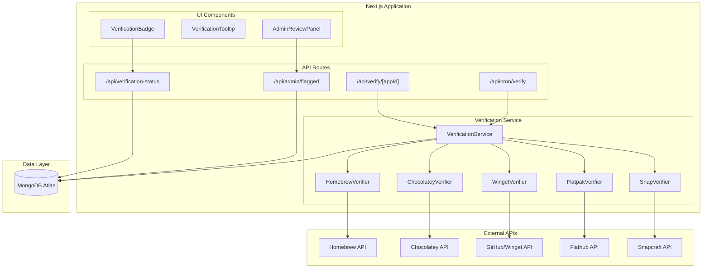

# Design Document: Package Verification System

## Overview

The Package Verification System is a backend service integrated into the Packmate Next.js application that validates package names against official package manager APIs. The system consists of:

1. **Verification Service**: Core logic for querying package manager APIs
2. **MongoDB Integration**: Persistent storage for verification results
3. **API Routes**: Next.js API endpoints for verification operations
4. **Scheduled Job**: Daily cron-triggered verification of all packages
5. **UI Components**: Verification badges and admin review interface

The architecture follows a modular design where each package manager has its own verifier implementation, allowing easy addition of new package managers in the future.

## Architecture



## Components and Interfaces

### Package Manager Verifiers

Each verifiable package manager has a dedicated verifier class implementing a common interface:

```typescript
// src/lib/verification/types.ts

export type VerificationStatus = 'verified' | 'failed' | 'pending' | 'unverifiable';

export interface VerificationResult {
  appId: string;
  packageManagerId: PackageManagerId;
  packageName: string;
  status: VerificationStatus;
  timestamp: string; // ISO 8601
  errorMessage?: string;
  manualReviewFlag?: boolean;
}

export interface PackageVerifier {
  packageManagerId: PackageManagerId;
  verify(packageName: string): Promise<VerificationResult>;
}
```

### Verifier Implementations

```typescript
// src/lib/verification/verifiers/homebrew.ts

export class HomebrewVerifier implements PackageVerifier {
  packageManagerId: PackageManagerId = 'homebrew';
  
  async verify(packageName: string): Promise<VerificationResult> {
    // Handle cask packages (prefixed with --cask)
    const isCask = packageName.startsWith('--cask ');
    const name = isCask ? packageName.replace('--cask ', '') : packageName;
    
    const baseUrl = isCask 
      ? 'https://formulae.brew.sh/api/cask'
      : 'https://formulae.brew.sh/api/formula';
    
    const response = await fetch(`${baseUrl}/${name}.json`);
    
    if (response.ok) {
      return { status: 'verified', /* ... */ };
    } else if (response.status === 404) {
      return { status: 'failed', errorMessage: 'Package not found' };
    }
    // Handle other errors...
  }
}
```

```typescript
// src/lib/verification/verifiers/chocolatey.ts

export class ChocolateyVerifier implements PackageVerifier {
  packageManagerId: PackageManagerId = 'chocolatey';
  
  async verify(packageName: string): Promise<VerificationResult> {
    const url = `https://community.chocolatey.org/api/v2/Packages()?$filter=Id eq '${packageName}'`;
    const response = await fetch(url, {
      headers: { 'Accept': 'application/json' }
    });
    
    const data = await response.json();
    const exists = data.d?.results?.length > 0;
    
    return exists 
      ? { status: 'verified', /* ... */ }
      : { status: 'failed', errorMessage: 'Package not found' };
  }
}
```

```typescript
// src/lib/verification/verifiers/winget.ts

export class WingetVerifier implements PackageVerifier {
  packageManagerId: PackageManagerId = 'winget';
  
  async verify(packageName: string): Promise<VerificationResult> {
    // Winget IDs are in format: Publisher.PackageName
    const [publisher, ...nameParts] = packageName.split('.');
    const name = nameParts.join('.');
    const firstLetter = publisher[0].toLowerCase();
    
    const url = `https://api.github.com/repos/microsoft/winget-pkgs/contents/manifests/${firstLetter}/${publisher}/${name}`;
    const response = await fetch(url, {
      headers: { 'Accept': 'application/vnd.github.v3+json' }
    });
    
    return response.ok
      ? { status: 'verified', /* ... */ }
      : { status: 'failed', errorMessage: 'Package not found' };
  }
}
```

```typescript
// src/lib/verification/verifiers/flatpak.ts

export class FlatpakVerifier implements PackageVerifier {
  packageManagerId: PackageManagerId = 'flatpak';
  
  async verify(packageName: string): Promise<VerificationResult> {
    const url = `https://flathub.org/api/v2/appstream/${packageName}`;
    const response = await fetch(url);
    
    return response.ok
      ? { status: 'verified', /* ... */ }
      : { status: 'failed', errorMessage: 'Package not found' };
  }
}
```

```typescript
// src/lib/verification/verifiers/snap.ts

export class SnapVerifier implements PackageVerifier {
  packageManagerId: PackageManagerId = 'snap';
  
  async verify(packageName: string): Promise<VerificationResult> {
    // Handle snap packages with flags (e.g., "slack --classic")
    const name = packageName.split(' ')[0];
    
    const url = `https://api.snapcraft.io/v2/snaps/info/${name}`;
    const response = await fetch(url, {
      headers: { 'Snap-Device-Series': '16' }
    });
    
    return response.ok
      ? { status: 'verified', /* ... */ }
      : { status: 'failed', errorMessage: 'Package not found' };
  }
}
```

### Verification Service

```typescript
// src/lib/verification/service.ts

export class VerificationService {
  private verifiers: Map<PackageManagerId, PackageVerifier>;
  private db: MongoClient;
  
  private static VERIFIABLE_MANAGERS: PackageManagerId[] = [
    'homebrew', 'chocolatey', 'winget', 'flatpak', 'snap'
  ];
  
  private static UNVERIFIABLE_MANAGERS: PackageManagerId[] = [
    'macports', 'apt', 'dnf', 'pacman', 'zypper', 'scoop'
  ];
  
  constructor(mongoClient: MongoClient) {
    this.db = mongoClient;
    this.verifiers = new Map([
      ['homebrew', new HomebrewVerifier()],
      ['chocolatey', new ChocolateyVerifier()],
      ['winget', new WingetVerifier()],
      ['flatpak', new FlatpakVerifier()],
      ['snap', new SnapVerifier()],
    ]);
  }
  
  async verifyPackage(
    appId: string, 
    packageManagerId: PackageManagerId, 
    packageName: string
  ): Promise<VerificationResult> {
    // Check if package manager is verifiable
    if (VerificationService.UNVERIFIABLE_MANAGERS.includes(packageManagerId)) {
      return this.createUnverifiableResult(appId, packageManagerId, packageName);
    }
    
    const verifier = this.verifiers.get(packageManagerId);
    if (!verifier) {
      return this.createUnverifiableResult(appId, packageManagerId, packageName);
    }
    
    const result = await this.executeWithRetry(() => 
      verifier.verify(packageName)
    );
    
    // Check if previously verified package now fails
    const previousResult = await this.getLatestResult(appId, packageManagerId);
    if (previousResult?.status === 'verified' && result.status === 'failed') {
      result.manualReviewFlag = true;
    }
    
    await this.storeResult(result);
    return result;
  }
  
  async verifyAllPackages(): Promise<VerificationSummary> {
    const summary = { total: 0, verified: 0, failed: 0, errors: 0 };
    
    for (const app of apps) {
      for (const [pmId, packageName] of Object.entries(app.targets)) {
        summary.total++;
        try {
          const result = await this.verifyPackage(
            app.id, 
            pmId as PackageManagerId, 
            packageName
          );
          if (result.status === 'verified') summary.verified++;
          else if (result.status === 'failed') summary.failed++;
          
          // Rate limiting delay
          await this.delay(100);
        } catch (error) {
          summary.errors++;
        }
      }
    }
    
    return summary;
  }
  
  private async executeWithRetry<T>(
    fn: () => Promise<T>, 
    maxRetries = 3
  ): Promise<T> {
    let lastError: Error | undefined;
    
    for (let attempt = 0; attempt < maxRetries; attempt++) {
      try {
        return await fn();
      } catch (error) {
        lastError = error as Error;
        await this.delay(Math.pow(2, attempt) * 1000); // Exponential backoff
      }
    }
    
    throw lastError;
  }
  
  private delay(ms: number): Promise<void> {
    return new Promise(resolve => setTimeout(resolve, ms));
  }
}
```

### API Routes

```typescript
// src/app/api/verify/[appId]/route.ts

export async function POST(
  request: Request,
  { params }: { params: { appId: string } }
) {
  const { packageManagerId } = await request.json();
  const app = apps.find(a => a.id === params.appId);
  
  if (!app) {
    return NextResponse.json({ error: 'App not found' }, { status: 404 });
  }
  
  const packageName = app.targets[packageManagerId as PackageManagerId];
  if (!packageName) {
    return NextResponse.json(
      { error: 'Package not available for this manager' }, 
      { status: 404 }
    );
  }
  
  const service = await getVerificationService();
  const result = await service.verifyPackage(
    params.appId, 
    packageManagerId, 
    packageName
  );
  
  return NextResponse.json(result);
}
```

```typescript
// src/app/api/verification-status/route.ts

export async function GET(request: Request) {
  const { searchParams } = new URL(request.url);
  const appId = searchParams.get('appId');
  const packageManagerId = searchParams.get('packageManagerId');
  
  const db = await getDatabase();
  const collection = db.collection('verification_results');
  
  if (appId && packageManagerId) {
    // Single status lookup
    const result = await collection.findOne(
      { appId, packageManagerId },
      { sort: { timestamp: -1 } }
    );
    return NextResponse.json(result);
  }
  
  // Bulk status lookup - get latest for each app/pm combination
  const pipeline = [
    { $sort: { timestamp: -1 } },
    { $group: {
      _id: { appId: '$appId', packageManagerId: '$packageManagerId' },
      latest: { $first: '$$ROOT' }
    }},
    { $replaceRoot: { newRoot: '$latest' } }
  ];
  
  const results = await collection.aggregate(pipeline).toArray();
  return NextResponse.json(results);
}
```

```typescript
// src/app/api/cron/verify/route.ts

export async function GET(request: Request) {
  // Verify cron secret for security
  const authHeader = request.headers.get('authorization');
  if (authHeader !== `Bearer ${process.env.CRON_SECRET}`) {
    return NextResponse.json({ error: 'Unauthorized' }, { status: 401 });
  }
  
  const service = await getVerificationService();
  const summary = await service.verifyAllPackages();
  
  console.log('Daily verification complete:', summary);
  
  return NextResponse.json(summary);
}
```

```typescript
// src/app/api/admin/flagged/route.ts

export async function GET(request: Request) {
  const { searchParams } = new URL(request.url);
  const packageManagerId = searchParams.get('packageManagerId');
  const sortBy = searchParams.get('sortBy') || 'timestamp';
  
  const db = await getDatabase();
  const collection = db.collection('verification_results');
  
  const query: Record<string, unknown> = { manualReviewFlag: true };
  if (packageManagerId) {
    query.packageManagerId = packageManagerId;
  }
  
  const results = await collection
    .find(query)
    .sort({ [sortBy]: -1 })
    .toArray();
  
  return NextResponse.json(results);
}

export async function PATCH(request: Request) {
  const { appId, packageManagerId } = await request.json();
  
  const db = await getDatabase();
  const collection = db.collection('verification_results');
  
  await collection.updateOne(
    { appId, packageManagerId, manualReviewFlag: true },
    { $set: { manualReviewFlag: false } }
  );
  
  return NextResponse.json({ success: true });
}
```

### UI Components

```typescript
// src/components/verification/VerificationBadge.tsx

interface VerificationBadgeProps {
  status: VerificationStatus;
  timestamp?: string;
  errorMessage?: string;
}

export function VerificationBadge({ 
  status, 
  timestamp, 
  errorMessage 
}: VerificationBadgeProps) {
  const { icon, color, label } = getBadgeConfig(status);
  
  const tooltipContent = status === 'failed' && errorMessage
    ? `${errorMessage}\nLast checked: ${formatDate(timestamp)}`
    : `Last verified: ${formatDate(timestamp)}`;
  
  return (
    <Tooltip content={tooltipContent}>
      <span className={`verification-badge ${color}`}>
        {icon}
        <span className="sr-only">{label}</span>
      </span>
    </Tooltip>
  );
}

function getBadgeConfig(status: VerificationStatus) {
  switch (status) {
    case 'verified':
      return { icon: <CheckCircle />, color: 'text-green-500', label: 'Verified' };
    case 'failed':
      return { icon: <XCircle />, color: 'text-red-500', label: 'Failed' };
    case 'unverifiable':
      return { icon: <AlertTriangle />, color: 'text-yellow-500', label: 'Unverifiable' };
    case 'pending':
    default:
      return { icon: <Clock />, color: 'text-gray-400', label: 'Pending' };
  }
}
```

```typescript
// src/components/admin/AdminReviewPanel.tsx

export function AdminReviewPanel() {
  const [flaggedPackages, setFlaggedPackages] = useState<VerificationResult[]>([]);
  const [filter, setFilter] = useState<PackageManagerId | 'all'>('all');
  const [sortBy, setSortBy] = useState<'timestamp' | 'appId'>('timestamp');
  
  useEffect(() => {
    fetchFlaggedPackages();
  }, [filter, sortBy]);
  
  async function fetchFlaggedPackages() {
    const params = new URLSearchParams();
    if (filter !== 'all') params.set('packageManagerId', filter);
    params.set('sortBy', sortBy);
    
    const response = await fetch(`/api/admin/flagged?${params}`);
    const data = await response.json();
    setFlaggedPackages(data);
  }
  
  async function handleResolve(appId: string, packageManagerId: string) {
    await fetch('/api/admin/flagged', {
      method: 'PATCH',
      body: JSON.stringify({ appId, packageManagerId })
    });
    fetchFlaggedPackages();
  }
  
  return (
    <div className="admin-review-panel">
      <div className="filters">
        <select value={filter} onChange={e => setFilter(e.target.value)}>
          <option value="all">All Package Managers</option>
          {VERIFIABLE_MANAGERS.map(pm => (
            <option key={pm} value={pm}>{pm}</option>
          ))}
        </select>
        <select value={sortBy} onChange={e => setSortBy(e.target.value)}>
          <option value="timestamp">Sort by Date</option>
          <option value="appId">Sort by App</option>
        </select>
      </div>
      
      <table>
        <thead>
          <tr>
            <th>App</th>
            <th>Package Manager</th>
            <th>Package Name</th>
            <th>Error</th>
            <th>Last Checked</th>
            <th>Actions</th>
          </tr>
        </thead>
        <tbody>
          {flaggedPackages.map(pkg => (
            <tr key={`${pkg.appId}-${pkg.packageManagerId}`}>
              <td>{pkg.appId}</td>
              <td>{pkg.packageManagerId}</td>
              <td>{pkg.packageName}</td>
              <td>{pkg.errorMessage}</td>
              <td>{formatDate(pkg.timestamp)}</td>
              <td>
                <button onClick={() => handleResolve(pkg.appId, pkg.packageManagerId)}>
                  Resolve
                </button>
              </td>
            </tr>
          ))}
        </tbody>
      </table>
    </div>
  );
}
```

## Data Models

### MongoDB Schema

```typescript
// Collection: verification_results

interface VerificationResultDocument {
  _id: ObjectId;
  appId: string;                    // e.g., "firefox", "vscode"
  packageManagerId: PackageManagerId; // e.g., "homebrew", "chocolatey"
  packageName: string;              // e.g., "--cask firefox", "Mozilla.Firefox"
  status: VerificationStatus;       // "verified" | "failed" | "pending" | "unverifiable"
  timestamp: string;                // ISO 8601 format
  errorMessage?: string;            // Present when status is "failed"
  manualReviewFlag?: boolean;       // True when needs admin attention
}

// Indexes
// - { appId: 1, packageManagerId: 1, timestamp: -1 } - For latest status lookup
// - { manualReviewFlag: 1, timestamp: -1 } - For admin review queries
// - { timestamp: -1 } - For audit/history queries
```

### Environment Variables

```bash
# .env.local
MONGODB_URI=mongodb+srv://<user>:<password>@cluster.mongodb.net/packmate
CRON_SECRET=<random-secret-for-cron-auth>
```

### Type Definitions

```typescript
// src/lib/verification/types.ts

export type VerificationStatus = 'verified' | 'failed' | 'pending' | 'unverifiable';

export interface VerificationResult {
  appId: string;
  packageManagerId: PackageManagerId;
  packageName: string;
  status: VerificationStatus;
  timestamp: string;
  errorMessage?: string;
  manualReviewFlag?: boolean;
}

export interface VerificationSummary {
  total: number;
  verified: number;
  failed: number;
  errors: number;
  unverifiable: number;
}

export interface PackageVerifier {
  packageManagerId: PackageManagerId;
  verify(packageName: string): Promise<VerificationResult>;
}

// Verifiable package managers (have public APIs)
export const VERIFIABLE_MANAGERS: PackageManagerId[] = [
  'homebrew', 'chocolatey', 'winget', 'flatpak', 'snap'
];

// Unverifiable package managers (no public APIs)
export const UNVERIFIABLE_MANAGERS: PackageManagerId[] = [
  'macports', 'apt', 'dnf', 'pacman', 'zypper', 'scoop'
];
```


## Correctness Properties

*A property is a characteristic or behavior that should hold true across all valid executions of a system—essentially, a formal statement about what the system should do. Properties serve as the bridge between human-readable specifications and machine-verifiable correctness guarantees.*

### Property 1: URL Construction for Verifiable Package Managers

*For any* verifiable package manager and any valid package name, the verifier SHALL construct the correct API URL according to the package manager's API specification.

- Homebrew: formulae use `https://formulae.brew.sh/api/formula/{name}.json`, casks (prefixed with `--cask`) use `https://formulae.brew.sh/api/cask/{name}.json`
- Chocolatey: `https://community.chocolatey.org/api/v2/Packages()?$filter=Id eq '{id}'`
- Winget: `https://api.github.com/repos/microsoft/winget-pkgs/contents/manifests/{first-letter}/{publisher}/{name}`
- Flatpak: `https://flathub.org/api/v2/appstream/{app_id}`
- Snap: `https://api.snapcraft.io/v2/snaps/info/{name}` (stripping any flags like `--classic`)

**Validates: Requirements 1.1, 1.2, 1.3, 1.4, 1.5**

### Property 2: Unverifiable Package Managers Return Unverifiable Status

*For any* package from an unverifiable package manager (MacPorts, APT, DNF, Pacman, Zypper, Scoop), the verification service SHALL return a result with status "unverifiable".

**Validates: Requirements 1.6**

### Property 3: Verification Results Contain Required Fields

*For any* verification result stored in the database, the result SHALL contain all required fields: appId, packageManagerId, packageName, status, and timestamp.

**Validates: Requirements 2.1**

### Property 4: Timestamps Are ISO 8601 Format

*For any* verification result, the timestamp field SHALL be a valid ISO 8601 formatted string.

**Validates: Requirements 2.2**

### Property 5: Failed Verifications Include Error Messages

*For any* verification result with status "failed", the result SHALL include a non-empty errorMessage field.

**Validates: Requirements 2.3**

### Property 6: Status Regression Triggers Manual Review Flag

*For any* package that transitions from "verified" status to "failed" status, the new verification result SHALL have manualReviewFlag set to true.

**Validates: Requirements 2.4**

### Property 7: Verification History Is Preserved

*For any* package verified multiple times, each verification SHALL create a new record, preserving the complete verification history.

**Validates: Requirements 2.5**

### Property 8: Retry Mechanism Attempts Correct Number of Times

*For any* API call that fails with a retryable error (timeout, 429), the verification service SHALL retry up to 3 times with exponential backoff before marking as failed.

**Validates: Requirements 3.3, 7.3**

### Property 9: Single Failure Does Not Stop Batch Processing

*For any* batch verification job, if one package verification fails, the service SHALL continue processing remaining packages.

**Validates: Requirements 3.5**

### Property 10: Badge Rendering Matches Status

*For any* verification status, the VerificationBadge component SHALL render the correct icon and color:
- "verified" → green checkmark
- "failed" → red X
- "unverifiable" → yellow warning
- "pending" → gray clock

**Validates: Requirements 4.1, 4.2, 4.3, 4.4**

### Property 11: Tooltip Content Matches Status

*For any* verification result, the tooltip SHALL display the last verification date. Additionally, for failed verifications, the tooltip SHALL also display the error message.

**Validates: Requirements 4.5, 4.6**

### Property 12: Admin Query Returns Only Flagged Packages

*For any* query to the admin flagged packages endpoint, all returned results SHALL have manualReviewFlag set to true.

**Validates: Requirements 5.1**

### Property 13: Resolve Action Clears Manual Review Flag

*For any* flagged package, calling the resolve action SHALL set manualReviewFlag to false.

**Validates: Requirements 5.3**

### Property 14: Admin Filter By Package Manager

*For any* admin query with a packageManagerId filter, all returned results SHALL have the matching packageManagerId.

**Validates: Requirements 5.4**

### Property 15: Admin Sort By Timestamp

*For any* admin query sorted by timestamp, the results SHALL be returned in descending order by timestamp.

**Validates: Requirements 5.5**

### Property 16: 404 Response Results in Failed Status

*For any* API response with status code 404, the verification result SHALL have status "failed" with errorMessage "Package not found".

**Validates: Requirements 7.1**

### Property 17: 429 Response Triggers Retry

*For any* API response with status code 429 (rate limited), the verification service SHALL wait and retry the request.

**Validates: Requirements 7.2**

### Property 18: Unexpected Errors Result in Failed Status with Details

*For any* API response with an unexpected error status, the verification result SHALL have status "failed" with the error details in errorMessage.

**Validates: Requirements 7.4**

### Property 19: Network Errors Preserve Previous Status

*For any* network error during verification, if a previous verification result exists, the service SHALL preserve the previous status and not overwrite it with a failed status.

**Validates: Requirements 7.5**

## Error Handling

### API Error Handling

| Error Type | HTTP Status | Handling Strategy |
|------------|-------------|-------------------|
| Package not found | 404 | Mark as "failed", set errorMessage to "Package not found" |
| Rate limited | 429 | Wait for Retry-After header duration, then retry |
| Server error | 5xx | Retry up to 3 times with exponential backoff |
| Timeout | - | Retry up to 3 times with exponential backoff |
| Network error | - | Log error, preserve previous status if exists |
| Invalid response | - | Mark as "failed", include response details in errorMessage |

### Retry Strategy

```typescript
async function executeWithRetry<T>(
  fn: () => Promise<T>,
  maxRetries = 3,
  baseDelay = 1000
): Promise<T> {
  let lastError: Error | undefined;
  
  for (let attempt = 0; attempt < maxRetries; attempt++) {
    try {
      return await fn();
    } catch (error) {
      lastError = error as Error;
      
      // Check if error is retryable
      if (!isRetryableError(error)) {
        throw error;
      }
      
      // Exponential backoff: 1s, 2s, 4s
      const delay = baseDelay * Math.pow(2, attempt);
      await sleep(delay);
    }
  }
  
  throw lastError;
}

function isRetryableError(error: unknown): boolean {
  if (error instanceof Response) {
    return error.status === 429 || error.status >= 500;
  }
  // Network errors are retryable
  return error instanceof TypeError && error.message.includes('fetch');
}
```

### Rate Limiting

Each package manager API has different rate limits:

| Package Manager | Rate Limit | Strategy |
|-----------------|------------|----------|
| Homebrew | Generous | 100ms delay between requests |
| Chocolatey | Moderate | 200ms delay between requests |
| Winget (GitHub) | 60/hour unauthenticated | 500ms delay, use auth token if available |
| Flatpak | Generous | 100ms delay between requests |
| Snap | Moderate | 200ms delay between requests |

### Database Error Handling

- Connection failures: Retry with exponential backoff, fail gracefully
- Write failures: Log error, do not crash the verification job
- Read failures: Return cached data if available, otherwise return empty results

## Testing Strategy

### Dual Testing Approach

This feature requires both unit tests and property-based tests for comprehensive coverage:

- **Unit tests**: Verify specific examples, edge cases, API response parsing, and error conditions
- **Property tests**: Verify universal properties across all inputs using fast-check

### Property-Based Testing Configuration

- **Library**: fast-check (already in devDependencies)
- **Minimum iterations**: 100 per property test
- **Tag format**: `Feature: package-verification, Property {number}: {property_text}`

### Test File Structure

```
packmate/src/__tests__/
├── lib/
│   └── verification/
│       ├── verifiers/
│       │   ├── homebrew.test.ts      # Unit + Property tests for Homebrew verifier
│       │   ├── chocolatey.test.ts    # Unit + Property tests for Chocolatey verifier
│       │   ├── winget.test.ts        # Unit + Property tests for Winget verifier
│       │   ├── flatpak.test.ts       # Unit + Property tests for Flatpak verifier
│       │   └── snap.test.ts          # Unit + Property tests for Snap verifier
│       ├── service.test.ts           # Unit + Property tests for VerificationService
│       └── types.test.ts             # Property tests for type validation
├── components/
│   └── verification/
│       ├── VerificationBadge.test.tsx  # Unit + Property tests for badge rendering
│       └── AdminReviewPanel.test.tsx   # Unit tests for admin panel
└── api/
    └── verification/
        ├── status.test.ts            # API endpoint tests
        └── admin.test.ts             # Admin API tests
```

### Unit Test Examples

```typescript
// Unit test for specific Homebrew formula
describe('HomebrewVerifier', () => {
  it('should verify existing formula', async () => {
    const verifier = new HomebrewVerifier();
    const result = await verifier.verify('git');
    expect(result.status).toBe('verified');
  });
  
  it('should handle cask packages', async () => {
    const verifier = new HomebrewVerifier();
    const result = await verifier.verify('--cask firefox');
    expect(result.status).toBe('verified');
  });
  
  it('should return failed for non-existent package', async () => {
    const verifier = new HomebrewVerifier();
    const result = await verifier.verify('definitely-not-a-real-package-xyz');
    expect(result.status).toBe('failed');
    expect(result.errorMessage).toBe('Package not found');
  });
});
```

### Property Test Examples

```typescript
// Property test for URL construction
import fc from 'fast-check';

describe('HomebrewVerifier URL Construction', () => {
  // Feature: package-verification, Property 1: URL Construction
  it('should construct correct URL for any valid package name', () => {
    fc.assert(
      fc.property(
        fc.string({ minLength: 1, maxLength: 50 }).filter(s => /^[a-z0-9-]+$/.test(s)),
        (packageName) => {
          const url = HomebrewVerifier.buildUrl(packageName);
          expect(url).toBe(`https://formulae.brew.sh/api/formula/${packageName}.json`);
        }
      ),
      { numRuns: 100 }
    );
  });
  
  it('should construct cask URL for --cask prefixed packages', () => {
    fc.assert(
      fc.property(
        fc.string({ minLength: 1, maxLength: 50 }).filter(s => /^[a-z0-9-]+$/.test(s)),
        (packageName) => {
          const url = HomebrewVerifier.buildUrl(`--cask ${packageName}`);
          expect(url).toBe(`https://formulae.brew.sh/api/cask/${packageName}.json`);
        }
      ),
      { numRuns: 100 }
    );
  });
});

// Property test for unverifiable package managers
describe('Unverifiable Package Managers', () => {
  // Feature: package-verification, Property 2: Unverifiable Status
  it('should return unverifiable for any package from unverifiable managers', () => {
    fc.assert(
      fc.property(
        fc.constantFrom(...UNVERIFIABLE_MANAGERS),
        fc.string({ minLength: 1, maxLength: 100 }),
        (packageManager, packageName) => {
          const service = new VerificationService(mockDb);
          const result = service.verifyPackage('test-app', packageManager, packageName);
          expect(result.status).toBe('unverifiable');
        }
      ),
      { numRuns: 100 }
    );
  });
});

// Property test for badge rendering
describe('VerificationBadge', () => {
  // Feature: package-verification, Property 10: Badge Rendering
  it('should render correct badge for any status', () => {
    const statusToExpected: Record<VerificationStatus, { color: string; icon: string }> = {
      verified: { color: 'text-green-500', icon: 'CheckCircle' },
      failed: { color: 'text-red-500', icon: 'XCircle' },
      unverifiable: { color: 'text-yellow-500', icon: 'AlertTriangle' },
      pending: { color: 'text-gray-400', icon: 'Clock' },
    };
    
    fc.assert(
      fc.property(
        fc.constantFrom<VerificationStatus>('verified', 'failed', 'unverifiable', 'pending'),
        (status) => {
          const { container } = render(<VerificationBadge status={status} />);
          const expected = statusToExpected[status];
          expect(container.querySelector(`.${expected.color}`)).toBeTruthy();
        }
      ),
      { numRuns: 100 }
    );
  });
});
```

### Integration Test Considerations

- Mock external APIs using MSW (Mock Service Worker) for consistent test results
- Test the full verification flow from API route to database storage
- Test the admin review workflow end-to-end
- Test ISR revalidation behavior with Next.js testing utilities
