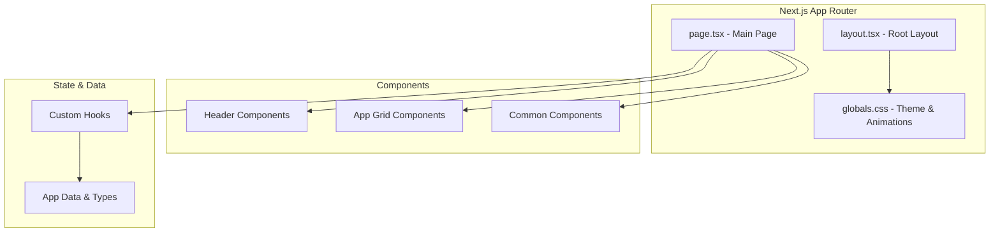
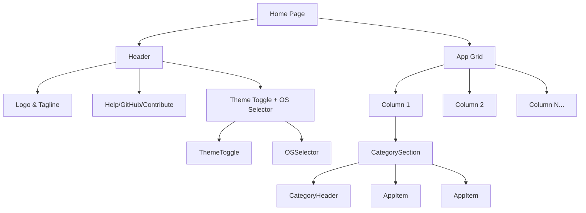

# Design Document: Packmate Skeleton UI

## Overview

This design document describes the architecture and implementation approach for the Packmate skeleton UI - a cross-platform bulk app installer interface. The design mirrors TuxMate's visual style and component patterns while adapting them for cross-platform (MacOS, Linux, Windows) use.

The skeleton UI establishes the foundational component structure, styling system, and state management patterns that will support the full application. It focuses on the visual presentation layer without implementing actual installation logic.

## Architecture

### High-Level Architecture



### Component Hierarchy



### Directory Structure

```
packmate/src/
├── app/
│   ├── page.tsx           # Main page component
│   ├── layout.tsx         # Root layout with fonts & theme
│   └── globals.css        # CSS variables, animations, theme
│
├── components/
│   ├── app/               # App display components
│   │   ├── AppIcon.tsx
│   │   ├── AppItem.tsx
│   │   ├── CategoryHeader.tsx
│   │   ├── CategorySection.tsx
│   │   └── index.ts
│   │
│   ├── header/            # Header components
│   │   ├── HowItWorks.tsx
│   │   ├── GitHubLink.tsx
│   │   ├── ContributeLink.tsx
│   │   └── index.ts
│   │
│   ├── os/                # OS selector components
│   │   ├── OSIcon.tsx
│   │   ├── OSSelector.tsx
│   │   └── index.ts
│   │
│   ├── ui/                # UI components
│   │   └── ThemeToggle.tsx
│   │
│   └── common/            # Shared components
│       ├── Tooltip.tsx
│       ├── LoadingSkeleton.tsx
│       └── index.ts
│
├── hooks/
│   ├── usePackmateInit.ts # Main state hook
│   ├── useTheme.tsx       # Theme context & hook
│   └── useTooltip.ts      # Tooltip positioning
│
└── lib/
    ├── data.ts            # App catalog & types
    └── utils.ts           # Utility functions
```

## Components and Interfaces

### Core Types

```typescript
// Operating System Types
type OSId = 'macos' | 'linux' | 'windows';

interface OS {
  id: OSId;
  name: string;
  iconUrl: string;
  color: string;
}

// Category Type
type Category =
  | 'Web Browsers'
  | 'Communication'
  | 'Dev: Languages'
  | 'Dev: Editors'
  | 'Dev: Tools'
  | 'Terminal'
  | 'CLI Tools'
  | 'Media'
  | 'Creative'
  | 'Gaming'
  | 'Office'
  | 'VPN & Network'
  | 'Security'
  | 'File Sharing'
  | 'System';

// App Data Type
interface AppData {
  id: string;
  name: string;
  description: string;
  category: Category;
  iconUrl: string;
  availability: {
    macos: boolean;
    linux: boolean;
    windows: boolean;
  };
}
```

### Component Interfaces

```typescript
// OSSelector Component
interface OSSelectorProps {
  selectedOS: OSId;
  onSelect: (id: OSId) => void;
}

// CategorySection Component
interface CategorySectionProps {
  category: Category;
  categoryApps: AppData[];
  selectedApps: Set<string>;
  isAppAvailable: (id: string) => boolean;
  selectedOS: OSId;
  toggleApp: (id: string) => void;
  isExpanded: boolean;
  onToggleExpanded: () => void;
  categoryIndex: number;
}

// AppItem Component
interface AppItemProps {
  app: AppData;
  isSelected: boolean;
  isAvailable: boolean;
  onToggle: () => void;
  onTooltipEnter: (text: string, event: React.MouseEvent) => void;
  onTooltipLeave: () => void;
  color: string;
}

// CategoryHeader Component
interface CategoryHeaderProps {
  category: string;
  isExpanded: boolean;
  onToggle: () => void;
  selectedCount: number;
  color: string;
}
```

### Main State Hook Interface

```typescript
interface UsePackmateInitReturn {
  // OS Selection
  selectedOS: OSId;
  setSelectedOS: (os: OSId) => void;
  
  // App Selection
  selectedApps: Set<string>;
  toggleApp: (id: string) => void;
  clearAll: () => void;
  selectedCount: number;
  
  // Availability
  isAppAvailable: (id: string) => boolean;
  
  // Hydration
  isHydrated: boolean;
}
```

## Data Models

### Operating Systems Data

```typescript
const operatingSystems: OS[] = [
  {
    id: 'macos',
    name: 'MacOS',
    iconUrl: 'https://api.iconify.design/simple-icons/apple.svg?color=%23000000',
    color: '#000000'
  },
  {
    id: 'linux',
    name: 'Linux',
    iconUrl: 'https://api.iconify.design/simple-icons/linux.svg?color=%23FCC624',
    color: '#FCC624'
  },
  {
    id: 'windows',
    name: 'Windows',
    iconUrl: 'https://api.iconify.design/simple-icons/windows.svg?color=%230078D4',
    color: '#0078D4'
  }
];
```

### Category Colors

```typescript
const categoryColors: Record<Category, string> = {
  'Web Browsers': 'orange',
  'Communication': 'blue',
  'Media': 'yellow',
  'Gaming': 'purple',
  'Office': 'indigo',
  'Creative': 'cyan',
  'System': 'red',
  'File Sharing': 'teal',
  'Security': 'green',
  'VPN & Network': 'emerald',
  'Dev: Editors': 'sky',
  'Dev: Languages': 'rose',
  'Dev: Tools': 'slate',
  'Terminal': 'zinc',
  'CLI Tools': 'gray'
};
```

### Sample App Data Structure

```typescript
const apps: AppData[] = [
  {
    id: 'firefox',
    name: 'Firefox',
    description: 'Privacy-focused open-source browser by Mozilla',
    category: 'Web Browsers',
    iconUrl: 'https://api.iconify.design/simple-icons/firefox.svg?color=%23FF7139',
    availability: { macos: true, linux: true, windows: true }
  },
  {
    id: 'vscode',
    name: 'VS Code',
    description: 'Most popular extensible code editor by Microsoft',
    category: 'Dev: Editors',
    iconUrl: 'https://api.iconify.design/logos/visual-studio-code.svg',
    availability: { macos: true, linux: true, windows: true }
  },
  // ... more apps
];
```

### Theme CSS Variables

```css
:root {
  /* Dark theme (default) */
  --bg-primary: #262522;
  --bg-secondary: #2f2e2a;
  --bg-tertiary: #3a3934;
  --bg-hover: #45433d;
  --text-primary: #f5f3ef;
  --text-secondary: #d8d4cc;
  --text-muted: #a09a8e;
  --border-primary: #45433d;
  --border-secondary: #504e46;
}

.light {
  /* Light theme */
  --bg-primary: #f5f2ed;
  --bg-secondary: #ebe8e2;
  --bg-tertiary: #e0dcd4;
  --bg-hover: #d8d4ca;
  --text-primary: #1a1815;
  --text-secondary: #3a3733;
  --text-muted: #5c5850;
  --border-primary: #d8d4ca;
  --border-secondary: #cec9bd;
}
```

### LocalStorage Keys

```typescript
const STORAGE_KEYS = {
  SELECTED_OS: 'packmate-os',
  SELECTED_APPS: 'packmate-apps',
  THEME: 'packmate-theme'
};
```


## Correctness Properties

*A property is a characteristic or behavior that should hold true across all valid executions of a system - essentially, a formal statement about what the system should do. Properties serve as the bridge between human-readable specifications and machine-verifiable correctness guarantees.*

### Property 1: OS Selection Round-Trip

*For any* operating system selection (macos, linux, or windows), storing the selection to localStorage and then reading it back should produce the same OS value.

**Validates: Requirements 2.4, 2.5**

### Property 2: Theme Toggle Round-Trip

*For any* initial theme state (dark or light), toggling the theme should flip the state, and persisting then restoring from localStorage should preserve the toggled state.

**Validates: Requirements 3.1, 3.2, 3.3**

### Property 3: App Selection Round-Trip

*For any* set of selected app IDs, storing the selection to localStorage and then reading it back should produce an equivalent set of app IDs.

**Validates: Requirements 9.1, 9.2**

### Property 4: Category Section Toggle

*For any* category section, clicking the header should toggle the expanded state from true to false or false to true.

**Validates: Requirements 5.3**

### Property 5: App Item Selection Toggle

*For any* available app item, clicking it should toggle its selection state - if selected it becomes unselected, if unselected it becomes selected.

**Validates: Requirements 6.2**

### Property 6: Category Selection Count Accuracy

*For any* category and any set of selected apps, the displayed badge count should equal the number of selected apps that belong to that category.

**Validates: Requirements 5.4**

### Property 7: App Data Completeness

*For any* app in the sample data, it should have all required fields: id (non-empty string), name (non-empty string), description (string), category (valid category), iconUrl (string), and availability object with macos, linux, and windows boolean flags.

**Validates: Requirements 8.2, 8.3**

### Property 8: Masonry Packing Balance

*For any* set of categories with varying app counts, the masonry packing algorithm should distribute categories such that the maximum column height difference is minimized (no column should be more than one category's worth of items taller than the shortest column).

**Validates: Requirements 4.5**

### Property 9: App Availability Filtering

*For any* app and any selected OS, the app should be marked as unavailable (dimmed) if and only if its availability flag for that OS is false.

**Validates: Requirements 6.6**

### Property 10: Clear All Selections

*For any* initial set of selected apps (including empty set), calling clearAll should result in an empty selection set with count equal to zero.

**Validates: Requirements 9.3**

## Error Handling

### localStorage Errors

- **Storage Quota Exceeded**: If localStorage is full, catch the error and continue with in-memory state only. Log a warning to console.
- **localStorage Unavailable**: If localStorage is not available (private browsing, disabled), fall back to in-memory state without persistence.
- **Corrupted Data**: If stored JSON is malformed, catch parse errors and reset to default state.

### Icon Loading Errors

- **Failed Icon Load**: AppIcon component should display a fallback icon (generic app icon) if the iconUrl fails to load.
- **Slow Icon Load**: Icons should have a loading state or placeholder to prevent layout shift.

### Hydration Errors

- **Hydration Mismatch**: Use `isHydrated` flag to prevent rendering state-dependent content until client-side hydration is complete.
- **SSR/Client Mismatch**: Ensure initial render matches server by not accessing localStorage during SSR.

### Invalid Data

- **Unknown Category**: If an app has an unrecognized category, place it in a "System" fallback category.
- **Missing Fields**: If app data is missing required fields, skip that app and log a warning.

## Testing Strategy

### Dual Testing Approach

This project uses both unit tests and property-based tests for comprehensive coverage:

- **Unit tests**: Verify specific examples, edge cases, and error conditions
- **Property tests**: Verify universal properties across all valid inputs

### Testing Framework

- **Test Runner**: Vitest
- **Testing Library**: React Testing Library with jest-dom matchers
- **Property-Based Testing**: fast-check library
- **Environment**: jsdom for DOM simulation

### Property-Based Test Configuration

Each property test should:
- Run minimum 100 iterations
- Use fast-check for input generation
- Reference the design document property in a comment tag

Tag format: `// Feature: packmate-skeleton-ui, Property N: [property description]`

### Test File Organization

```
packmate/src/__tests__/
├── setup.ts                    # Test setup and matchers
├── data.test.ts               # App data validation (Property 7)
├── hooks/
│   ├── usePackmateInit.test.ts # State management (Properties 1, 3, 5, 6, 10)
│   └── useTheme.test.ts        # Theme toggle (Property 2)
├── components/
│   ├── CategorySection.test.tsx # Category toggle (Property 4)
│   └── AppItem.test.tsx         # App availability (Property 9)
└── lib/
    └── packing.test.ts          # Masonry algorithm (Property 8)
```

### Unit Test Coverage

Unit tests should cover:
- Component rendering with various props
- User interaction handlers (click, hover)
- Edge cases (empty data, single item, many items)
- Error states (missing icons, invalid data)
- Accessibility (ARIA attributes, keyboard navigation)

### Example Property Test Structure

```typescript
import { fc } from 'fast-check';
import { describe, it, expect } from 'vitest';

describe('OS Selection Round-Trip', () => {
  // Feature: packmate-skeleton-ui, Property 1: OS selection round-trip
  it('should preserve OS selection through localStorage', () => {
    fc.assert(
      fc.property(
        fc.constantFrom('macos', 'linux', 'windows'),
        (os) => {
          localStorage.setItem('packmate-os', os);
          const restored = localStorage.getItem('packmate-os');
          return restored === os;
        }
      ),
      { numRuns: 100 }
    );
  });
});
```
